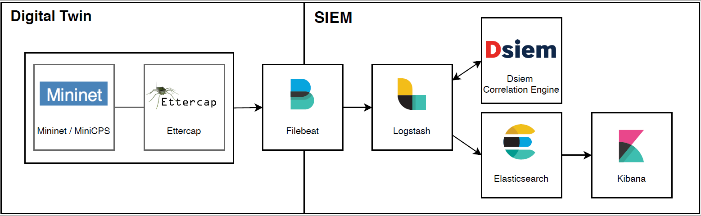

# DigitalTwin-SIEM-integration

The **DigitalTwin-SIEM-integration** prototype orginates from a research approach to integrate digital twin simulations 
in current enterprise security operations and systems like Security Information and Event Management (SIEM) tools. 

This prototype relies on a microservice architecture composed with **Docker**. The tools used for the **DigitalTwin** part
are [Mininet](http://mininet.org)-based [MiniCPS](https://github.com/scy-phy/minicps) and [Ettercap](https://www.ettercap-project.org/). 
Filebeat is used to gather the log data from the logs folder.
The **SIEM** part is realized with [Dsiem](https://www.dsiem.org/), on top of [Filebeat, Elasticsearch, Logstash and Kibana](https://www.elastic.co/).



The **DigitalTwin-SIEM-integration** prototype allows to:
 - build and run a simulation of a filling plant and start an MITM attack (**DigitalTwin** simulation)
 - create and store system logs of the filling plant's PLCs 
 - integrate the system logs into a fully-fledged **SIEM** tool that
 - detects the attack based on implemented rules


## Installation
The complete integration of the SIEM and digital twin simulation can be deployed by following the description of the **Docker** section.                                                                                         
To run the digital twin simulation of the filling plant alone follow the instructions given in the **Installation of the DigitalTwin** section below.

### Complete Installation of the Setup with Docker
Docker Compose is the most convenient way to setup the project:
1. Install Docker Compose as explained here: https://docs.docker.com/compose/install/
2. Download and unzip or clone the project:
    ```bash
    git clone https://github.com/FrauThes/DigitalTwin-SIEM-integration.git
    ```
3. Run the init script:
    ```bash
    cd /deployments/docker && \
    sudo sh init.sh
    ```
4. Enter the IP address or Hostname of the server when requested. For example:
    ```
    Enter the Hostname or IP Address where your elasticsearch will be deployed:192.168.2.120
    ```
5. The script is trying to import the Dsiem dashboard to Kibana. This may take a few minutes. Until Kibana is up and running, error messages are shown. This is normal. Example error message:
    ```
    curl: (22) The requested URL returned error: 503 Service Unavailable
    cannot connect to localhost:5601, will retry in 5 sec ..
    ```
6. The project is ready. You can now open Kibana in your browser:
    ```
    http://192.168.2.120:5601/
    ```
    replace **192.168.2.120** with the IP you have set previously.

The Project is up and running. If you want to start it a second time you simply have to navigate to deployments/docker and run `docker-compose up`.

### Exclusive Installation of the DigitalTwin 
 The description of the **DigitalTwin** simulation and its exclusive installation can be found 
 in the [readme of the src folder](src/README.md).


## Research and Citation
Please consider citing our [ARES'20](https://doi.org/10.1145/3407023.3407039) publication when using the **DigitalTwin-SIEM-integration** or the **DigitalTwin** simulation of the filling plant for your research.
