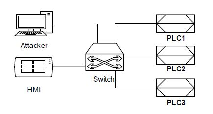
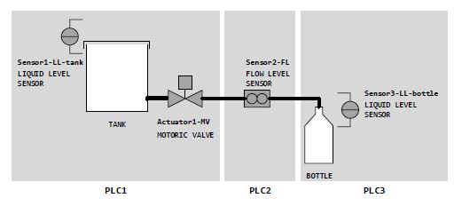
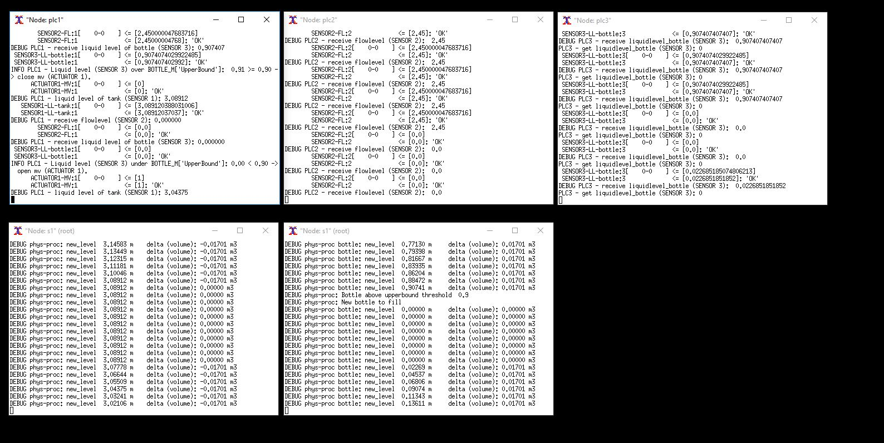
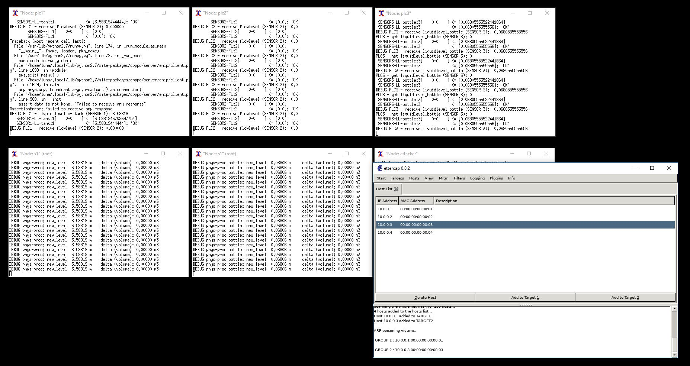

# DigitalTwin: Simulation of a filling-plant

The following describes the **DigitalTwin** part of the **DigitalTwin-SIEM-integration** prototype. 
The **DigitalTwin** of this prototpye simulates a filling-plant, consisting of three PLCs (PLC1, PLC2, PLC3), a HMI 
an attacker (that has maliciously entered the network) that are connected by a switch.



The three PLCs control the physical process of the filling plant as follows.
*PLC3* manages the Sensor3 that informs about the liquid level of the bottle to be filled ("*Sensor3-LL-bottle*").
*PLC2* manages the Sensor2 that informs about the flow level of the pipe ("*Sensor2-FL*").
*PLC1* manages the Sensor1 that informs about the liquid level of the tank ("*Sensor1-LL-tank*") as well as 
the Actuator1 to close or open the motoric valve ("*Actuator1-MV*"). 
Moreover, *PLC1* decides whether to open or close the motoric valve based on the level of the tank ("*Sensor1-LL-tank*"), 
and the flow level of the pipe ("*Sensor2-FL*") received from PLC2 and the level of the bottle ("*Sensor3-LL-bottle*") 
received from PLC3. 




## Installation
To install the **DigitalTwin** simulation of a filling plant please follow the instructions given below in the *exact order*.
You can use a VM that runs on Linux Ubuntu (e.g. VirtualBox with Ubuntu 18.04). 
When running on a VM, use SSH and X11-forwarding for window display (e.g. PuTTy in combination with XMing).

### Install mininet
To install [Mininet](http://mininet.org) execute the following commands:
```bash
git clone git://github.com/mininet/mininet
cd mininet
mininet/util/install.sh -a
```
Afterwards, test whether the installation was successful:
```bash
sudo mn --test pingall
```
If successful, run the following commands to exit the Mininet-CLI and cleanup the simulation:
```bash
mininet> exit
mn -c
```
Additional help is given at the [Mininet installation website](http://mininet.org/download/).

### Install MiniCPS
To install [MiniCPS](https://github.com/scy-phy/minicps) either use
```bash
pip install minicps
```
or clone the [MiniCPS-GitHub project](https://github.com/scy-phy/minicps).

### Install Ettercap, Wireshark & Co.
For the installation of [Ettercap](https://www.ettercap-project.org/):
```bash
sudo apt-get install ettercap-graphical
```

### Initiate the DigitalTwin
Execute the following commands in the *src*-folder of this project.
To initiate state and topology of the filling-plant simulation run the following commands.
To create the SQLLite-Table that simulates the physical state (*Sensor1*,*Sensor2*,*Sensor3* and *Actuator1*):
```bash
python init.py
```
To create the topology and ping all nodes:
```bash
sudo python run.py
```
The last command should produce the following output:
```bash
*** Ping: testing ping reachability
attacker -> hmi plc1 plc2 plc3
hmi -> attacker plc1 plc2 plc3
plc1 -> attacker hmi plc2 plc3
plc2 -> attacker hmi plc1 plc3
plc3 -> attacker hmi plc1 plc2
*** Results: 0% dropped (20/20 received)
mininet>
```
### Start the simulation of the physical process
To start the scripts that simulate physical behavior and the machines logic 
open the following nodes in a new terminal window by the following command:
```bash
mininet> xterm plc1 plc2 plc3 s1 s1
```
This command will produce an error if SSH and X11-forwarding is not set up correctly.
Execute the following scripts in the *respective nodes* and strictly in the following order 
(alternatively uncomment the lines in the *run.py* before executing *run.py*):
```bash
on node s1: python physical_process_bottle.py 
on node s1: python physical_process.py
on node plc3: python plc3.py
on node plc2: python plc2.py
on node plc1: python plc1.py
```
By running these commands the physical process and control logic is started which should produce output
in the respective terminal windows of the nodes. 



Moreover, the logs-folder should now be filled with the following log files containing system logs:
- plc1.log
- plc2.log
- plc3.log

### Attack the physical process
By opening a window on the *attacker* node Ettercap can be started. 
```bash
mininet> xterm attacker

on node attacker: ettercap --gtk 
```
It is also possible to start Wireshark. Make sure to install Wireshark beforehand.

### Exit and cleanup
Afterwards run the following commands to exit and cleanup the simulation:
```bash
mininet> exit
mn -c
```

## Usage
### Attack simulation
By installing various tools (e.g. Ettercap, Wireshark etc.) the attacker node can try a multitude of possible attacks.
The following shows the respective nodes and their output when the *attacker* runs an Ettercap MITM ARP
spoofing attack between *PLC1* (target1) and *PLC3* (target2).



### System logs
The system logs in the *logs*-folder indicate whether the PLCs can communicate without problems (see extract of *plc1.log*): 
```bash
INFO 03/16/2020 13:30:26 10.0.0.1 main_loop Liquid level (SENSOR 3) under BOTTLE_M['UpperBound']: 0.88 < 0.90 -> open mv (ACTUATOR 1).
INFO 03/16/2020 13:30:28 10.0.0.1 main_loop Flow level (SENSOR 2) under SENSOR2_THRESH:  2.45 < 3.00 -> leave mv status (ACTUATOR 1).
INFO 03/16/2020 13:30:29 10.0.0.1 main_loop Liquid level (SENSOR 3) over BOTTLE_M['UpperBound']:  0.91 >= 0.90 -> close mv (ACTUATOR 1).
```

Whenever an network problem is present (e.g. caused by an attacker as shown above) it produces warnings.
The following warning shows that *PLC1* is not able to receive the Sensor3-data from *PLC3*, but 
still receives the Sensor2-data from *PLC2* (see extract of *plc1.log*):
```bash
INFO 03/16/2020 13:34:40 10.0.0.1 main_loop Flow level (SENSOR 2) under SENSOR2_THRESH:  0.00 < 3.00 -> leave mv status (ACTUATOR 1).
WARNING 03/16/2020 13:34:45 10.0.0.1 main_loop Liquid level (SENSOR 3) is not received. Program is unable to proceed properly
```

## Research and Citation
Please consider citing this GitHub repository if you are using our  **DigitalTwin** simulation of the filling plant.
